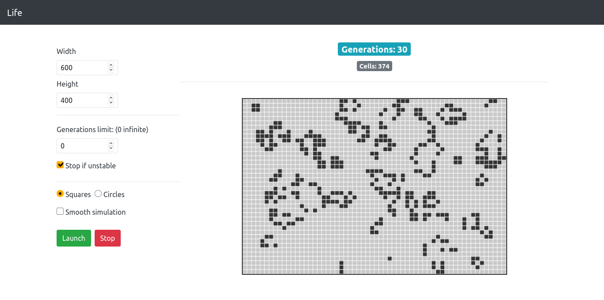

<h1 align="center">Life</h1>

    An implementation of Conway's Game of Life using ReactJS and P5.js

## What is Game of Life?

The Game of Life, is a cellular automaton devised by the British mathematician John Horton Conway in 1970.

The game is a zero-player game, meaning that its evolution is determined by its initial state, requiring no further input. One interacts with the Game of Life by creating an initial configuration and observing how it evolves. [More info.](https://en.wikipedia.org/wiki/Conway%27s_Game_of_Life)

Currently the simulation starts from a random generated state, but a feature allowing to customize initial state will be added in the future.

## Screenshot

